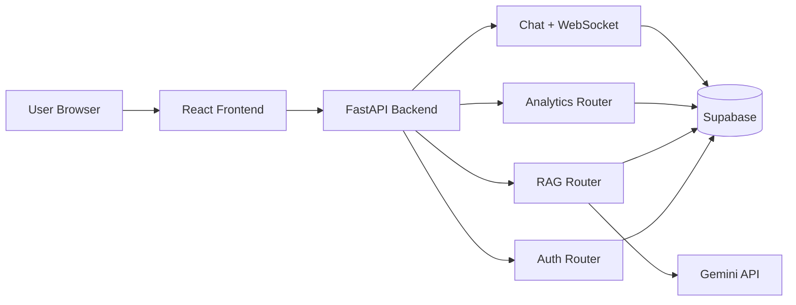

# EduRag Architecture Overview

## High-Level Components

- Frontend: React SPA (`src/`), role-based dashboards for Student/Teacher/Admin.
- Backend: FastAPI (`backend/`) with modular routers for auth, users, feedback, RAG, analytics, and chat.
- Data Layer: Supabase tables + storage for user records, feedback, PDFs, chunks, and embeddings.
- AI Layer: Gemini models for embeddings + answer generation in `backend/routers/rag.py`.

## Request Flow

## Security Controls

- JWT-based authentication for protected routes.
- Role checks for admin/teacher/student actions.
- In-memory rate limiting middleware in `backend/main.py`.
- Security headers middleware (`X-Frame-Options`, CSP, HSTS, etc.).
- Restricted CORS allowlist + regex for trusted preview hosts.

## Real-Time Channel

- WebSocket endpoint: `/api/ws/chat`
- Broadcast model in `WebSocketConnectionManager`.

## CI and Quality Gates

- GitHub Actions workflow: `.github/workflows/ci.yml`
- Runs on every push and pull request.
- Includes backend tests (`pytest`), frontend tests (Jest/RTL), linting (ESLint + flake8 + pylint), and `pre-commit` hooks.
